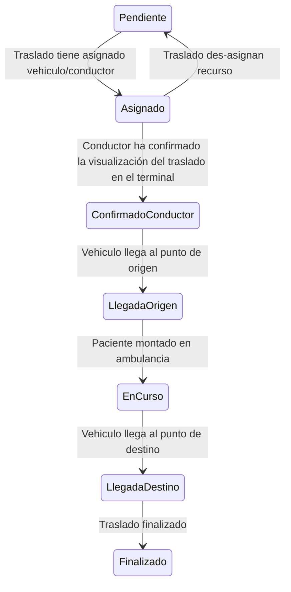
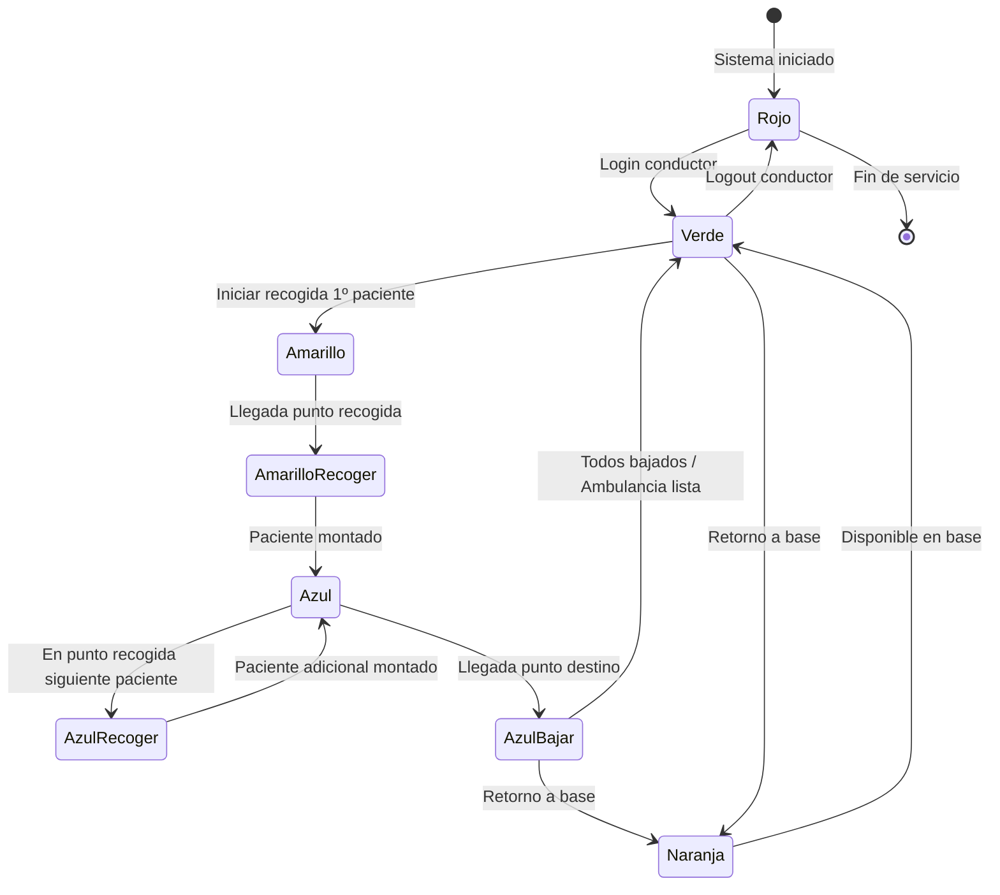

# Guía de Integración — API de Integración de Transporte (v1.0.0)

## 1. Introducción y Circuito

- Título: API de Integración de Transporte
- Versión: 1.0.0
- Servidor base: https://api.miempresa.com/v1

**Descripción de la operativa**

Esta API permite la integración entre la Empresa Concesionaria y CCTSES para reportar y consultar eventos operativos clave del servicio de transporte sanitario. Los casos de uso principales incluyen:
- Reporte de estados de recursos de flota en un momento dado (vehículos, jornadas, traslados, modos especiales, posicionamiento periódico).
- Gestión del ciclo de vida de traslados: anulación, reactivación y marcados específicos (paciente-avisar).

### Flujo típico de operación (alto nivel)

1) Inicio de jornada del conductor y declaración de la actividad a realizar (p. ej. PROGRAMADO, URGENCIA). El vehículo queda disponible y sus cambios de estado se reportan mediante eventos de status.
2) Asignación de un traslado a un vehículo y conductor. Se reportan cambios de estado del traslado (pendiente, asignado, confirmado, llegado a origen, en curso, llegado a destino, finalizado) y, en paralelo, los estados del vehículo.
3) Durante la prestación, se emiten eventos periódicos de posicionamiento (GPS) y cambios de modo especial (p. ej. comida, fuera de servicio) cuando aplique.
4) En caso necesario, el traslado puede ser anulado indicando un motivo estandarizado; también es posible su reactivación. Adicionalmente, puede marcarse el estado paciente-avisar sobre un traslado con una hora de recogida prevista.

Nota: Los nombres de campos, rutas y tipos de datos en esta guía provienen del OpenAPI (verdad técnica). Las descripciones funcionales, tablas de códigos y contexto proceden del diccionario funcional.

## 2. Información Funcional y SLAs

- Frecuencia de actualización de datos: cada 5 minutos (regla general de negocio).
- Ventanas de mantenimiento: la API puede devolver HTTP 503 los domingos de 03:00 a 04:00 (hora local), durante tareas de mantenimiento.
- Tiempos de respuesta (SLA): no se han declarado campos x-response-time-sla en el OpenAPI para este circuito. Si se acuerdan SLAs específicos, deben documentarse en una versión futura del contrato.
- Otros metadatos x- del OpenAPI: no se han definido x-data-frequency ni otros x-atributos en este documento.

## 4. Diccionario de Entidades

A continuación se describen las entidades principales según el contrato OpenAPI, complementadas con las tablas de códigos funcionales.

### 4.1 StatusInfo
**Estructura JSON (resumen técnico)**
- type: object
- properties:
  - status: array de Status

Descripción: Conjunto de eventos de estado reportados en un instante dado para distintos recursos de la flota.

### 4.2 Status
**Estructura JSON (resumen técnico)**
- type: object
- required: idVehiculo, idUnidad, fechaHora
- properties relevantes:
  - idTrasladoCCTSES (string, nullable): Id único de traslado en CCTSES
  - idTrasladoExterno (string, nullable): Id único de traslado en el sistema externo
  - idVehiculo (string): Matrícula del vehículo asociado
  - idUnidad (string): Unidad administrativa
  - idEstadoTraslado (string, nullable): Código de estado del traslado
  - idEstadoVehiculo (string, nullable): Código de estado del vehículo
  - fechaHora (string, date-time): Fecha/hora local del estado (ej.: 2021-02-12T20:26:28+02:00)
  - idMotivo (string, nullable): Motivo del origen del status
  - gps (Gps): Posición donde se generó el status
  - idActividadJornada (string, nullable): Tipo de actividad en la jornada
  - idJornada (string, nullable): Identificador de la jornada

**Tablas de referencia funcionales**

**TB_TRASLADO_ESTADOS (para idEstadoTraslado)**

| Código | Leyenda              | Descripción Funcional |
|:-------|:---------------------|:----------------------|
| P      | PENDIENTE            | Traslado creado pero sin asignar recursos |
| A      | ASIGNADO             | Traslado asignado a conductor y vehículo |
| CC     | CONFIRMADO CONDUCTOR | Conductor confirma/visualiza en terminal |
| LO     | LLEGADO-ORIGEN       | Llegada al punto de origen |
| E      | CURSADO              | Paciente embarcado, traslado en curso |
| LD     | LLEGADO-DESTINO      | Llegada al destino con el paciente |

#### Diagrama de flujo de estados del traslado

**TB_VEHICULO_ESTADOS (para idEstadoVehiculo)**

| Código | Leyenda         | Descripción Funcional |
|:-------|:----------------|:----------------------|
| 0      | Rojo            | Sin conductor logueado (fuera de servicio) |
| 1      | Verde           | Disponible sin traslados en ejecución |
| 2      | Naranja         | Retorno a base sin pacientes |
| 3      | Amarillo        | En ruta para recoger primer paciente |
| 4      | Azul            | Con pacientes a bordo |
| 10     | AmarilloRecoger | En punto de recogida (esperando) |
| 11     | AzulRecoger     | Recogida paciente adicional |
| 12     | AzulBajar       | En destino iniciando desembarque |

#### Diagrama de flujo de estados del vehículo 

**TB_ACTIVIDAD_TIPOS (para idActividadJornada)**

| Código | Leyenda      | Descripción |
|:-------|:-------------|:------------|
| 1      | PROGRAMADO   | Traslados programados (citas, consultas, tratamientos) |
| 2      | URGENCIA     | Servicios de urgencia no programados |
| 3      | UME          | Unidad Medicalizada de Emergencia |
| 5      | CENTRO SALUD | Traslados asociados a centros de salud |
| 6      | UMTS         | Unidad Móvil de Transporte Sanitario |
| 7      | UMAR         | Unidad Móvil de Alta Resolución |
| 8      | SVB          | Soporte Vital Básico |

**TB_MOTIVO_ESTADOS (para idMotivo)**

Tipos de recurso y motivos característicos:
- VEHICULO-POSICIONAMIENTO: 1=LOCALIZACION, 11=INFORMACION-PERIODICA
- TRASLADO: 2=TRASLADO CAMBIO ESTADO, 4=TRASLADO-ASIGNACION, 5=TRASLADO-DESASIGNACIÓN
- VEHICULO-ESTADO: 3=VEHICULO CAMBIO ESTADO
- VEHICULO-MODOS: 24=Ninguno, 25=Comida, 26=Fuera-Servicio
- JORNADA: 30=Inicio, 31=Fin
- GENÉRICO: 0=DESCONOCIDA

**Campos requeridos por tipo de recurso (resumen funcional)**
- VEHICULO-ESTADO: idVehiculo, idUnidad, idEstadoVehiculo, fechaHora, idMotivo=3, gps, idActividadJornada, idJornada
- VEHICULO-POSICIONAMIENTO: idVehiculo, idUnidad, fechaHora, idMotivo=1|11, gps, idActividadJornada, idJornada, (idEstadoVehiculo recomendado)
- VEHICULO-MODOS: idVehiculo, idUnidad, fechaHora, idMotivo∈{24,25,26}, gps, idActividadJornada, idJornada
- TRASLADO: idTrasladoCCTSES|idTrasladoExterno, idVehiculo, idUnidad, idEstadoTraslado, fechaHora, idMotivo∈{2,4,5}, gps, idActividadJornada, idJornada
- JORNADA: idVehiculo, idUnidad, fechaHora, idMotivo∈{30,31}, gps, idActividadJornada, idJornada

### 4.3 Gps
**Estructura JSON (resumen técnico)**
- type: object
- required: longitud, latitud, rumbo, velocidad
- properties:
  - longitud (string): grados decimales
  - latitud (string): grados decimales
  - rumbo (number)
  - velocidad (integer)

### 4.4 TrasladoAnulaDto
**Estructura JSON (resumen técnico)**
- type: object
- required: fechaHora, idMotivo
- properties:
  - trasladoIDs (string, nullable): IDs separados por coma
  - fechaHora (string, date-time): fecha de solicitud de cancelación
  - idMotivo (string): motivo de anulación (texto libre o código interno)
  - txMotivo (string, nullable): texto del motivo

**Tabla funcional de motivos de anulación (TB_ANULACION_MOTIVOS)**

| Código | Leyenda          | Descripción Funcional |
|:-------|:-----------------|:----------------------|
| AA     | Anul. agenda     | Anulación por cambios en la agenda |
| BC     | Baja Civitas     | Baja del paciente en Civitas |
| BD     | Bloq. dietario   | Bloqueo en el dietario |
| CA     | C. estr. agenda  | Cambio en la estructura de agenda |
| CAM    | Camilla ocupada  | Sin camilla disponible |
| CC     | Cancelac. cita   | Cancelación de la cita |
| CD     | Cita duplicada   | Cita duplicada |
| CE     | Cita errónea     | Error en el registro de la cita |
| CH     | Cambio hora      | Cambio de hora |
| CM     | Cambio médico    | Cambio de médico asignado |
| CO     | Prest. Otro Cen  | Prestación en otro centro |
| CP     | Cambio Prestac.  | Cambio de prestación |
| CT     | Prest. Cen Conc  | Prestación en centro concertado |
| DIN    | Datos incorrec.  | Datos incorrectos |
| DUP    | Duplicado        | Duplicidad de solicitud |
| ECR    | e-Consulta Rech  | Rechazo de e-Consulta |
| ENF    | Enfermo/a        | Paciente enfermo |
| ER1    | Error en disp.   | Error en dispositivo |
| ER2    | Rechazo pacient  | Rechazo explícito del paciente |
| ERR    | Error            | Error genérico |
| EX     | Exitus           | Fallecimiento |
| FAL    | Fallecido        | Fallecimiento |
| FDO    | Falta document.  | Falta de documentación |
| FHO    | Fuera de hora    | Fuera de horario |
| FTO    | Fin tratamiento  | Fin de tratamiento |
| HAN    | Anula hospital   | Anulación por hospital |
| IDA    | Ida (medios pr)  | Ida por medios propios |
| IL     | Ilocalizacion    | No se localiza al paciente |
| ING    | Ingresado        | Paciente ingresado |
| NCA    | Ausente casa     | Ausente en domicilio |
| NCO    | Consulta         | Relacionado con consulta |
| NPE    | Ausente          | Ausente |
| NSV    | Sin vuelta sol.  | Vuelta sin solicitud |
| OM     | Otros motivos    | No categorizados |
| PA     | Alta/Traslado    | Alta médica o traslado |
| PAN    | Paciente anula   | Solicitud del paciente |
| PNP    | Pac. No prepar.  | Paciente no preparado |
| PRE    | Pac. Ret. 112    | Retenido por 112 |
| RET    | Retraso Receta   | Retraso en receta |
| REU    | Reubicación      | Reubicación |
| RM     | Reprog. múltipl  | Reprogramación múltiple |
| RP     | Reprogramación   | Reprogramación |
| SIF    | Anulación SIF    | Anulación desde SIF |
| SM     | Decisión Médica  | Decisión médica |
| SNS    | Error disp SNS   | Error dispositivo SNS |
| SO     | Sat. Demanda OM  | Saturación demanda |
| SP     | Solic. Paciente  | Solicitud del paciente |
| SUS    | Suspensión       | Suspensión |
| TER    | Terminación      | Terminación |
| VIN    | Vehículo inop.   | Vehículo inoperativo |
| VRE    | Visado Rechazado | Visado rechazado |
| VUE    | Vuelta (medios)  | Vuelta por medios propios |

### 4.5 TrasladoReactivaDto
**Estructura JSON (resumen técnico)**
- type: object
- required: fechaHora, idMotivo
- properties:
  - trasladoIDs (string, nullable): IDs separados por coma
  - fechaHora (string, date-time): fecha de la solicitud
  - idMotivo (string): motivo de la reactivación
  - txMotivo (string, nullable): texto del motivo

Nota funcional: aunque el contrato no referencia una tabla específica para idMotivo en reactivación, se recomienda reutilizar criterios de clasificación análogos a los de anulación cuando aplique, documentando su catálogo en acuerdos bilaterales.

### 4.6 Response y Result
**Estructura JSON (resumen técnico)**
- Response
  - resultado: Result
- Result (required: estado, codigo, descripcion)
  - estado (string): AA=ok, AE=Error
  - codigo (string): 000 en ejecución correcta
  - descripcion (string): Descripción asociada al código o detalle del error

## 5. Referencia de Operaciones (Endpoints)

**Agrupación por áreas funcionales (no hay tags declarados en el OpenAPI):**

### Área: Estado
- POST /api/integra/trans/v1/status/
  - operationId: status
  - Resumen: Crea o actualiza una orden; reporta información de estado de recursos.
  - Request Body: application/json → StatusInfo
  - Respuestas: 201/400/500 → Response

**Parámetros clave**
- Body: StatusInfo

### Área: Traslado
- DELETE /api/integra/trans/v1/traslado/{trasladoIDs}
  - operationId: traslado
  - Resumen: Anula uno o varios traslados
  - Parámetros:
    - path trasladoIDs (string, requerido): IDs separados por coma
    - query fechaHora (string, date-time, requerido): fecha de solicitud de cancelación
    - query idMotivo (string, requerido): motivo de anulación (texto libre)
    - query txMotivo (string, opcional): texto del motivo
  - Respuestas: 201/400/500 → Response

- PUT /api/integra/trans/v1/traslado/reactivar
  - operationId: putTrasladoReactivacion
  - Resumen: Reactiva uno o varios traslados
  - Request Body: application/json → TrasladoReactivaDto
  - Respuestas: 201/400/500 → Response

- PUT /api/integra/trans/v1/traslado/setPacienteAvisar/{trasladoId}
  - operationId: putPacienteAvisar
  - Resumen: Establece el estado paciente-avisar sobre un traslado
  - Parámetros:
    - path trasladoId (string, requerido)
    - query horaRecoger (string, date-time, requerido)
  - Respuestas: 201/500 → Response

Referencia a entidades: ver sección 4 para estructuras de StatusInfo, Status, Gps, TrasladoReactivaDto, Response/Result.

## 7. Ejemplos de Uso

Nota: Se muestran ejemplos mínimos, remitiendo a las entidades definidas para la estructura completa.

1) Reporte de estado (POST /status)

curl -X POST "https://api.miempresa.com/v1/api/integra/trans/v1/status/" \
  -H "Content-Type: application/json" \
  -d '{
        "status": [
          {
            "idVehiculo": "1234-ABC",
            "idUnidad": "U-01",
            "fechaHora": "2025-01-15T10:20:30+01:00",
            "idMotivo": "3",
            "idEstadoVehiculo": "1",
            "gps": { "longitud": "-3.70379", "latitud": "40.41678", "rumbo": 180, "velocidad": 0 },
            "idActividadJornada": "1",
            "idJornada": "JRN-20250115-01"
          }
        ]
      }'

2) Anulación de traslados (DELETE /traslado/{trasladoIDs})

curl -X DELETE "https://api.miempresa.com/v1/api/integra/trans/v1/traslado/TRL-1001,TRL-1002?fechaHora=2025-01-15T11:00:00+01:00&idMotivo=RP&txMotivo=Reprogramacion" \
  -H "Accept: application/json"

3) Reactivación de traslados (PUT /traslado/reactivar)

curl -X PUT "https://api.miempresa.com/v1/api/integra/trans/v1/traslado/reactivar" \
  -H "Content-Type: application/json" \
  -d '{
        "trasladoIDs": "TRL-1001,TRL-1002",
        "fechaHora": "2025-01-15T12:00:00+01:00",
        "idMotivo": "Reactivacion operativa",
        "txMotivo": "Paciente disponible"
      }'

4) Marcar paciente-avisar (PUT /traslado/setPacienteAvisar/{trasladoId})

curl -X PUT "https://api.miempresa.com/v1/api/integra/trans/v1/traslado/setPacienteAvisar/TRL-1001?horaRecoger=2025-01-15T12:30:00+01:00" \
  -H "Accept: application/json"

### Consideraciones de errores y respuestas
- En respuestas exitosas se espera estado=AA y código=000 dentro de Result.
- En errores (AE), utilice la descripción para diagnósticos y reintentos respetando ventanas de mantenimiento.

---

## Apéndice A: Reglas y diagramas (resumen)
- Los diagramas de flujo de estados de Traslado y Vehículo están documentados en el diccionario funcional y deben ser considerados como guía de negocio para comprender las transiciones válidas.

## Apéndice B: Convenciones
- Fechas en formato ISO 8601 con offset de zona horaria.
- Códigos de estado/motivo en mayúsculas/numéricos según tablas declaradas.
- Para catálogos no cerrados, acordar en anexo bilateral la codificación adicional antes de su uso en producción.