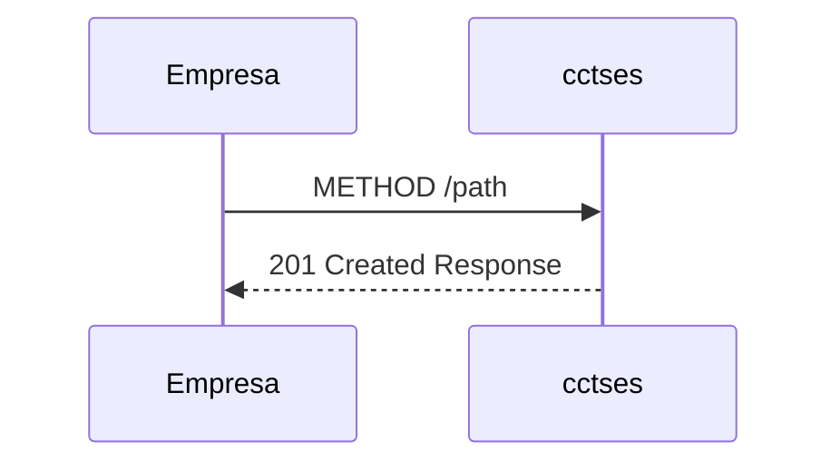

# Plan detallado para regenerar la documentación técnica del Circuito A (Material for MkDocs)

Fecha: 2025-11-15 19:58

## 1. Propósito
Este documento explica, paso a paso, cómo volver a generar y mantener la documentación técnica del Circuito A utilizando:
- La definición OpenAPI: docs/CircuitoA/CircuitoA-openapi.yaml
- La documentación funcional/tablas TB_: docs/CircuitoA/CircuitoA-doc_funcional.md
- El documento técnico: docs/CircuitoA/circuitoA-doc.md
- La configuración del sitio: mkdocs.yml

Objetivo: una documentación coherente y navegable en Material for MkDocs, con admonitions, ejemplos con resaltado, diagrama Mermaid y enlaces internos correctos.

---

## 2. Pre‑requisitos
- OpenAPI 3.0 actualizada con endpoints, parámetros, requestBody y responses.
- Documento funcional con tablas TB_ y anclas estables (entidad-tb_...).
- MkDocs con tema Material (admonition, details, superfences/mermaid, highlight) ya activado en mkdocs.yml.
- Estructura de navegación en mkdocs.yml que incluya:
  - "4.1 Empresa - ️CCTSES" → docs/CircuitoA/circuitoA-doc.md
  - "4.2 Tablas" → docs/CircuitoA/CircuitoA-doc_funcional.md

---

## 3. Ficheros implicados
- docs/CircuitoA/circuitoA-doc.md → Documento técnico final.
- docs/CircuitoA/CircuitoA-doc_funcional.md → Tablas TB_ y reglas funcionales.
- docs/CircuitoA/CircuitoA-openapi.yaml → Fuente de verdad de operaciones y modelos.
- mkdocs.yml → Navegación, tema y extensiones.

---

## 4. Convenciones de formato (Material for MkDocs)
- Título de operación: número correlativo y ruta, seguido de una línea en blanco.
  Ejemplo: `1) POST /api/integra/trans/v1/status/`
- Tabla principal de 2 columnas: "Propiedad" y "Descripción". Filas típicas: Método, Ruta, operationId, Resumen, Descripción y/o Body, Respuestas, Reglas/Observaciones.
- No incluir filas "Parámetros" ni "Campos" dentro de la tabla principal.
- Parámetros en un bloque de admonición info con título "Parámetros". Dentro, subtítulos `Path` y/o `Query`, cada uno con tabla de 3 columnas: `Propiedad | Tipo | Descripción`. Respetar indentación (4 espacios) para que el contenido quede dentro del cuadro.
- Tipos de datos en un bloque de admonición info con título "Tipos de datos". Por cada modelo, su nombre y una tabla de 3 columnas: `Propiedad | Tipo | Descripción`.
- Ejemplos: usar bloques de código con lenguaje `json` para JSON y `text` para líneas de llamada.
- Enlaces a TB_ usando anclas explícitas del documento funcional (ver sección 8).
- Diagrama Mermaid de secuencia con participantes: `Empresa` (izquierda) y `cctses` (derecha), incluyendo petición y respuesta `201` para cada operación.

---

## 5. Pasos detallados para regenerar
1) Revisar OpenAPI (docs/CircuitoA/CircuitoA-openapi.yaml)
   - Verificar `servers.url`, `info.title` y `info.version`.
   - Comprobar que cada path incluye `operationId`, `summary`, `description`, `parameters` y/o `requestBody`, y `responses` con schemas existentes en `components`.

2) Sincronizar la sección "Información general de la API" en circuitoA-doc.md
   - Nombre, Versión y Base URL deben reflejar OpenAPI.

3) Actualizar el diagrama Mermaid de secuencia
   - Debe listar todas las operaciones en orden lógico: POST status, DELETE traslado, PUT reactivar, PUT setPacienteAvisar.
   - Para cada línea: `Empresa ->> cctses` con METHOD y PATH; respuesta: `cctses -->> Empresa` con `201 Created Response`.

4) Para cada operación REST, crear la sección con este patrón
   - Título con numeración y ruta, y una línea en blanco.
   - Tabla principal (Propiedad | Descripción) con: Método, Ruta, operationId, Resumen, Descripción o Body (application/json: Modelo), Respuestas y Reglas/Observaciones si aplica.

5) Extraer PARÁMETROS a un bloque independiente
   - Insertar un bloque de admonición info titulado "Parámetros".
   - Dentro, secciones `Path` y/o `Query` con tablas de 3 columnas. Indicar obligatoriedad en la descripción (Requerido/Opcional).

6) Extraer TIPOS DE DATOS a un bloque independiente
   - Insertar un bloque de admonición info titulado "Tipos de datos".
   - Incluir cada modelo involucrado (por ejemplo: `StatusInfo`, `Status`, `Gps`, `TrasladoReactivaDto`) con tabla de 3 columnas.

7) Añadir ejemplos
   - Ejemplo de request (si hay body) en bloque de código `json` con contenido válido.
   - Ejemplo de llamada (sin body) en bloque de código `text` con la URL construida.
   - Ejemplo de respuesta (201) en bloque `json`.

8) Insertar enlaces a TB_ en campos y reglas
   - Usar estas anclas del documento funcional:
     - `TB_TRASLADO_ESTADOS` → `CircuitoA-doc_funcional.md#entidad-tb_traslado_estados`
     - `TB_VEHICULO_ESTADOS` → `CircuitoA-doc_funcional.md#entidad-tb_vehiculo_estados`
     - `TB_ACTIVIDAD_TIPOS` → `CircuitoA-doc_funcional.md#entidad-tb_actividad_tipos`
     - `TB_MOTIVO_ESTADOS` → `CircuitoA-doc_funcional.md#entidad-tb_motivo_estados`

9) Mantener mejoras en el documento funcional
   - Cada bloque "Tipo:" debe incluir la línea `Titulo de Recurso: …` (VEHICULO, TRASLADO, JORNADA, GENÉRICO).
   - No cambiar códigos ni descripciones salvo necesidad justificada; sí asegurar anclas correctas.

10) Validación de estilo y renderizado
    - Comprobar línea en blanco tras cada título de endpoint.
    - Verificar que los bloques info muestran su contenido dentro del cuadro (indentación consistente en todo el bloque).
    - Confirmar que ejemplos usan `json` o `text` correctamente y que el JSON es válido.
    - Probar los enlaces a TB_ y la navegación desde el menú de MkDocs.

11) Build/preview del sitio (opcional)
    - Si se dispone de entorno local: ejecutar `mkdocs serve` y revisar visualmente la sección Circuito A.

---

## 6. Endpoints actuales (sincronizados con OpenAPI)
- POST /api/integra/trans/v1/status/
- DELETE /api/integra/trans/v1/traslado/{trasladoIDs}
- PUT /api/integra/trans/v1/traslado/reactivar
- PUT /api/integra/trans/v1/traslado/setPacienteAvisar/{trasladoId}

Revisar siempre `CircuitoA-openapi.yaml` por si se añaden o cambian endpoints.

---

## 7. Plantillas reutilizables

### 7.1. Sección de operación (esqueleto)
```
N) METHOD /ruta/

| Propiedad | Descripción |
|:--|:--|
| Método | METHOD |
| Ruta | /ruta/ |
| operationId | opId |
| Resumen | … |
| Descripción | … |
| Body | application/json: Modelo (si aplica) |
| Respuestas | 201: Response<br>400: Response<br>500: Response |

??? info "Parámetros"

    Path

    | Propiedad | Tipo | Descripción |
    |:--|:--|:--|
    | paramPath | string | Requerido. |

    Query

    | Propiedad | Tipo | Descripción |
    |:--|:--|:--|
    | paramQuery | string | Opcional. |

??? info "Tipos de datos"

    Modelo

    | Propiedad | Tipo | Descripción |
    |:--|:--|:--|
    | campo | tipo | … |

**Ejemplo de request**
```json
{ /* … */ }
```

**Ejemplo de respuesta (201)**
```json
{ "resultado": { "estado": "AA", "codigo": "000", "descripcion": "OK" } }
```
```

### 7.2. Diagrama Mermaid (esqueleto)


---

## 8. Checklist de control de calidad
- [ ] Títulos numerados con línea en blanco posterior.
- [ ] Tabla principal con encabezados "Propiedad" y "Descripción".
- [ ] Bloque info "Parámetros" con tablas Path/Query de 3 columnas.
- [ ] Bloque info "Tipos de datos" con tablas de 3 columnas.
- [ ] Ejemplos con lenguaje `json` o `text` correcto.
- [ ] Enlaces TB_ apuntan a las anclas del documento funcional.
- [ ] Diagrama Mermaid actualizado con todas las operaciones.
- [ ] Navegación de mkdocs.yml coherente y visible.

---

## 9. Problemas frecuentes y soluciones
- El contenido del bloque info no se muestra dentro del cuadro: revisar indentación (todo el contenido debe estar indentado de forma homogénea).
- Un enlace a TB_ no funciona: confirmar el slug del ancla en `CircuitoA-doc_funcional.md` (respetar guiones bajos y minúsculas).
- Mermaid no renderiza: simplificar textos (evitar comillas desbalanceadas o caracteres especiales), y comprobar que la extensión mermaid está activa en `mkdocs.yml`.
- JSON sin resaltado: usar bloque con lenguaje `json` y JSON válido.

---

## 10. Decisiones tomadas (histórico)
- Separación de "Parámetros" y "Tipos de datos" en bloques info independientes para mejorar legibilidad.
- Tabla principal de 2 columnas para metadatos del endpoint; tablas de 3 columnas para parámetros y modelos.
- Enlaces normalizados a tablas TB_ mediante anclas estables.
- Diagrama Mermaid de secuencia entre Empresa y cctses para las 4 operaciones actuales.
- Refuerzo de ejemplos con bloques `json`/`text` y línea en blanco tras títulos.

---

## 11. Próximas extensiones (opcional)
- Automatizar parte del volcado de OpenAPI a Markdown (p. ej., con plugins o scripts), manteniendo el formato pactado.
- Añadir pruebas de validación para enlaces internos y bloques Mermaid.

---

Autoría: Equipo de Documentación Técnica
Ubicación del presente plan: docs/.support/Plan-Regeneracion-CircuitoA.md