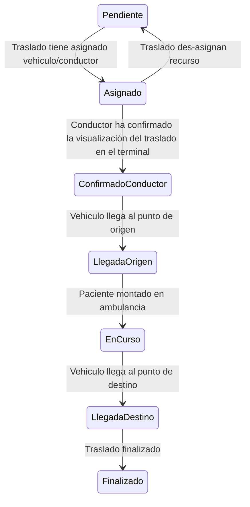
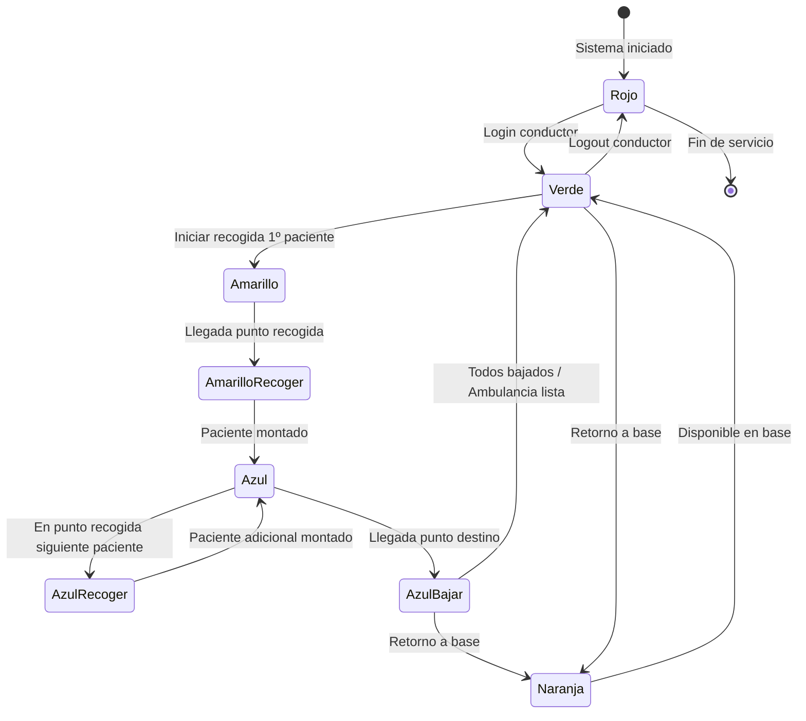

# Circuito A: Empresa Concesionaria - CCTSES

## Entidad: TB_ANULACION_MOTIVOS

Esta tabla recoge los motivos de anulación de un traslado. 

No se permite una anulación con un identificador de motivo no registrado en la tabla.

| Código | Leyenda           | Descripción Funcional                                                           |
|:-------|:------------------|:--------------------------------------------------------------------------------|
| AA     | Anul. agenda      | Anulación de traslado por cambios en la agenda del servicio                     |
| BC     | Baja Civitas      | Traslado cancelado por baja del paciente en el sistema Civitas                  |
| BD     | Bloq. dietario    | Anulación debido a bloqueo en el dietario médico                                |
| CA     | C. estr. agenda   | Cancelación por cambio en la estructura de la agenda                            |
| CAM    | Camilla ocupada   | Traslado anulado porque no hay camilla disponible                               |
| CC     | Cancelac. cita    | Anulación por cancelación de la cita médica asociada                            |
| CD     | Cita duplicada    | Traslado cancelado por existir una cita duplicada en el sistema                 |
| CE     | Cita errónea      | Anulación debido a error en el registro de la cita                              |
| CH     | Cambio hora       | Traslado anulado por cambio en la hora de la cita                               |
| CM     | Cambio médico     | Cancelación por cambio del médico asignado                                      |
| CO     | Prest. Otro Cen   | Prestación realizada en otro centro sanitario                                   |
| CP     | Cambio Prestac.   | Anulación por cambio en el tipo de prestación médica                            |
| CT     | Prest. Cen Conc   | Prestación atendida en centro concertado                                        |
| DIN    | Datos incorrec.   | Traslado cancelado por datos incorrectos del paciente o servicio                |
| DUP    | Duplicado         | Anulación por duplicidad de solicitud de traslado                               |
| ECR    | e-Consulta Rech   | Traslado anulado por rechazo de e-Consulta                                      |
| ENF    | Enfermo/a         | Cancelación porque el paciente está enfermo y no puede acudir                   |
| ER1    | Error en disp.    | Anulación por error en el dispositivo de gestión                                |
| ER2    | Rechazo pacient   | Traslado cancelado por rechazo explícito del paciente                           |
| ERR    | Error             | Anulación por error genérico no especificado                                    |
| EX     | Exitus            | Cancelación por fallecimiento del paciente                                      |
| FAL    | Fallecido         | Traslado anulado debido al fallecimiento del paciente                           |
| FDO    | Falta document.   | Cancelación por falta de documentación necesaria                                |
| FHO    | Fuera de hora     | Anulación porque el traslado está fuera del horario establecido                 |
| FTO    | Fin tratamiento   | Traslado cancelado por finalización del tratamiento médico                      |
| HAN    | Anula hospital    | Anulación realizada por el hospital                                             |
| IDA    | Ida (medios pr)   | Cancelación del trayecto de ida por medios propios del paciente                 |
| IL     | Ilocalizacion     | Traslado anulado por imposibilidad de localizar al paciente                     |
| ING    | Ingresado         | Cancelación porque el paciente está ingresado                                   |
| NCA    | Ausente casa      | Traslado anulado por ausencia del paciente en su domicilio                      |
| NCO    | Consulta          | Cancelación relacionada con la consulta médica                                  |
| NPE    | Ausente           | Traslado anulado por ausencia del paciente                                      |
| NSV    | Sin vuelta sol.   | Cancelación del trayecto de vuelta sin solicitud                                |
| OM     | Otros motivos     | Anulación por motivos no categorizados                                          |
| PA     | Alta/Traslado     | Cancelación por alta médica o traslado a otro centro                            |
| PAN    | Paciente anula    | Traslado anulado por solicitud del paciente                                     |
| PNP    | Pac. No prepar.   | Cancelación porque el paciente no está preparado para el traslado               |
| PRE    | Pac. Ret. 112     | Traslado anulado por retención del paciente por servicio 112                    |
| RET    | Retraso Receta    | Cancelación por retraso en la receta médica                                     |
| REU    | Reubicación       | Traslado anulado por reubicación del servicio o paciente                        |
| RM     | Reprog. múltipl   | Anulación por reprogramación múltiple de citas                                  |
| RP     | Reprogramación    | Traslado cancelado por reprogramación de la cita                                |
| SIF    | Anulación SIF     | Anulación realizada desde el sistema SIF                                        |
| SM     | Decisión Médica   | Traslado cancelado por decisión médica                                          |
| SNS    | Error disp SNS    | Anulación por error en el dispositivo del Sistema Nacional de Salud             |
| SO     | Sat. Demanda OM   | Cancelación por saturación de demanda de otros motivos                          |
| SP     | Solic. Paciente   | Traslado anulado por solicitud del paciente                                     |
| SUS    | Suspensión        | Anulación por suspensión del servicio                                           |
| TER    | Terminación       | Traslado cancelado por terminación del servicio                                 |
| VIN    | Vehículo inop.    | Anulación por vehículo inoperativo o no disponible                              |
| VRE    | Visado Rechazado  | Traslado cancelado por rechazo del visado médico                                |
| VUE    | Vuelta (medios)   | Cancelación del trayecto de vuelta por medios propios del paciente              |


## Entidad: TB_TRASLADO_ESTADOS

Esta tabla recoge los estados por los que un traslado puede pasar desde su alta, hasta su finalización.

| Código | Leyenda               | Descripción Funcional                                                               |
|:-------|:----------------------|:------------------------------------------------------------------------------------|
| P      | PENDIENTE             | Traslado creado pero sin asignar recursos (conductor ni vehículo)                   |
| A      | ASIGNADO              | Traslado asignado a conductor y vehículo específicos                                |
| CC     | CONFIRMADO CONDUCTOR  | El conductor ha confirmado y visualizado el traslado en el Terminal Embarcado       |
| LO     | LLEGADO-ORIGEN        | El vehículo ha llegado al punto de origen para la recogida del paciente             |
| E      | CURSADO               | El paciente está embarcado en la ambulancia y el traslado está en curso             |
| LD     | LLEGADO-DESTINO       | El vehículo ha llegado al punto de destino con el paciente                          |


### Diagrama de Flujo de Estados del Traslado



## Entidad: TB_VEHICULO_ESTADOS

Esta tabla recoge los estados de un vehículo/ambulancia en su diario de trabajo.

| Código | Leyenda         | Descripción Funcional                                                                      |
|:-------|:----------------|:-------------------------------------------------------------------------------------------|
| 0      | Rojo            | Vehículo sin conductor logueado y sin actividad indicada (fuera de servicio)               |
| 1      | Verde           | Conductor logueado y vehículo disponible sin traslados en ejecución                        |
| 2      | Naranja         | Conductor logueado y vehículo disponible retornando a base sin pacientes                   |
| 3      | Amarillo        | Vehículo en ruta para recoger al primer paciente de la ruta                                |
| 4      | Azul            | Vehículo con al menos un paciente a bordo, transportando o recogiendo pacientes adicionales|
| 10     | AmarilloRecoger | Vehículo llegado al punto de recogida del primer paciente, esperando embarque              |
| 11     | AzulRecoger     | Vehículo con paciente(s) a bordo, llegado al punto de recogida de paciente adicional       |
| 12     | AzulBajar       | Vehículo llegado a punto de destino, iniciando desembarque de paciente(s)                  |

### Diagrama de Flujo de Estados del Vehículo



## Entidad: TB_ACTIVIDAD_TIPOS

Una actividad indica el tipo de operativa o tipo de servicio que la ambulancia va a realizar durante esta jornada o turno de trabajo.

Esta tabla recoge los tipos de actividades que son objeto de integración.

| Código | Leyenda       | Descripción Funcional                                                                  |
|:-------|:--------------|:---------------------------------------------------------------------------------------|
| 1      | PROGRAMADO    | Traslados sanitarios programados con antelación (citas, consultas, tratamientos)       |
| 2      | URGENCIA      | Servicios de urgencia no programados que requieren atención inmediata                  |
| 3      | UME           | Unidad Medicalizada de Emergencia para situaciones críticas con soporte vital avanzado |
| 4      | UP            | ???                                                                                    |
| 5      | CENTRO SALUD  | Traslados específicos desde/hacia centros de salud de atención primaria                |
| 6      | UMTS          | Unidad Móvil de Transporte Sanitario para traslados medicalizados                      |
| 7      | UMAR          | Unidad Móvil de Alta Resolución para atención especializada in situ                    |
| 8      | SVB           | Soporte Vital Básico para emergencias que requieren atención sanitaria sin medicalizar |


## Entidad: TB_MOTIVO_STATUS

Los llamados `status` son una parte fundamental del sistema, ya que permiten conocer en tiempo real la situación de la flota, 
a través del estado de sus recursos, vehiculos, traslados, .. y la operativa que se realiza en cada uno de ellos.

Cada recurso tiene un conjunto de `status` que debe reportar.

Cada `status` reportará una información u otra, dependiendo del tipo de recurso, y por tanto la información obligatoria será diferente en base al tipo de `status`.

En base en esto los tipos de `status` se pueden puede generar por los siguientes recursos:

- `VEHICULO-ESTADO`: Cambios de estado de un vehículo.
- `VEHICULO-MODOS`: Estados especiales de funcionamiento que puede estar un vehículo. 
- `VEHICULO-POSICIONAMIENTO`: Información a intervalos periódicos de información GPS del vehículo.
- `TRASLADO`: Cambios de estados por los que pasa un traslado en su ejecución.
- `JORNADA`: Cambios de estados de una jornada de trabajo.

De esta forma, los motivos de los cambios de estado son estos:

##### Tipo: VEHICULO-POSICIONAMIENTO

**Campos requeridos:**

- `idVehiculo` - Matrícula del vehículo
- `idUnidad` - Unidad administrativa
- `fechaHora` - Fecha y hora de la posición
- `idMotivo` - Motivo del status (código 1: LOCALIZACION o código 11: INFORMACION-PERIODICA)
- `gps` - Posición GPS del vehículo (longitud, latitud, rumbo, velocidad)
- `idActividadJornada` - Tipo de actividad de la jornada
- `idJornada` - Identificador de la jornada de trabajo
- `idEstadoVehiculo` - Estado actual del vehículo (opcional pero recomendado en INFORMACION-PERIODICA)

Tabla de Referencia:

| Código | Leyenda               | Descripción Funcional                                                      | Referencia                        |
|:-------|:----------------------|:---------------------------------------------------------------------------|:----------------------------------|
| 1      | LOCALIZACION          | Información de localización y posicionamiento GPS del vehículo             | Ver sección [Vehículo](#vehiculo) |
| 11     | INFORMACION-PERIODICA | Envío periódico de información completa del estado y posición del vehículo | Ver sección [Vehículo](#vehiculo) |

##### Tipo: TRASLADO

Los estados por los que pasa un traslado están recogidos en la tabla [`TB_TRASLADO_ESTADOS`](#entidad-tb_traslado_estados).

**Campos requeridos:**

- `idTrasladoCCTSES` - ID único del traslado en CCTSES (si fue generado por CCTSES)
- `idTrasladoExterno` - ID único del traslado en el sistema externo
- `idVehiculo` - Matrícula del vehículo asignado
- `idUnidad` - Unidad administrativa
- `idEstadoTraslado` - Estado del traslado (referencia [`TB_TRASLADO_ESTADOS`](#entidad-tb_traslado_estados))
- `fechaHora` - Fecha y hora del cambio de estado del traslado
- `idMotivo` - Motivo del status (código 2: TRASLADO CAMBIO ESTADO, 4: TRASLADO-ASIGNACION, 5: TRASLADO-DESASIGNACIÓN)
- `gps` - Posición GPS del vehículo en el momento del cambio de estado
- `idActividadJornada` - Tipo de actividad de la jornada
- `idJornada` - Identificador de la jornada de trabajo

Tabla de Referencia:

| Código | Leyenda                | Descripción Funcional                                                  | Referencia                                                |
|:-------|:-----------------------|:-----------------------------------------------------------------------|:----------------------------------------------------------|
| 2      | TRASLADO CAMBIO ESTADO | Notificación de cambio de estado en el ciclo de vida de un traslado    | Ver [`TB_TRASLADO_ESTADOS`](#entidad-tb_traslado_estados) |
| 4      | TRASLADO-ASIGNACION    | Asignación de recursos (conductor y vehículo) a un traslado específico | Ver [`TB_TRASLADO_ESTADOS`](#entidad-tb_traslado_estados) |
| 5      | TRASLADO-DESASIGNACIÓN | Liberación de recursos previamente asignados a un traslado             | Ver [`TB_TRASLADO_ESTADOS`](#entidad-tb_traslado_estados) |

#### Tipo: VEHICULO-ESTADO

Los estados por los que pasa un vehículo están recogidos en la tabla [`TB_VEHICULO_ESTADOS`](#entidad-tb_vehiculo_estados).

La gestión de un vehículo está estrechamente vinculada a la Jornada de Trabajo y a la actividad que se realiza en ella.
Un `status` de un vehículo siempre debe estar encuadrado en una Jornada de Trabajo, y en la jornada se realizará un tipo de Actividad específico.

**Campos requeridos:**

- `idVehiculo` - Matrícula del vehículo
- `idUnidad` - Unidad administrativa
- `idEstadoVehiculo` - Estado del vehículo (referencia [`TB_VEHICULO_ESTADOS`](#entidad-tb_vehiculo_estados))
- `fechaHora` - Fecha y hora del cambio de estado
- `idMotivo` - Motivo del cambio (código 3: VEHICULO CAMBIO ESTADO)
- `gps` - Posición GPS del vehículo (longitud, latitud, rumbo, velocidad)
- `idActividadJornada` - Tipo de actividad de la jornada (referencia [`TB_ACTIVIDAD_TIPOS`](#entidad-tb_actividad_tipos))
- `idJornada` - Identificador de la jornada de trabajo

Tabla de Referencia:

| Código | Leyenda                | Descripción Funcional                                      | Referencia                                                |
|:-------|:-----------------------|:-----------------------------------------------------------|:----------------------------------------------------------|
| 3      | VEHICULO CAMBIO ESTADO | Notificación de cambio en el estado operativo del vehículo | Ver [`TB_VEHICULO_ESTADOS`](#entidad-tb_vehiculo_estados) |

#### Tipo: VEHICULO-MODOS (Modos Especiales)

*Campos requeridos:*

- `idVehiculo` - Matrícula del vehículo
- `idUnidad` - Unidad administrativa
- `fechaHora` - Fecha y hora del cambio de modo
- `idMotivo` - Motivo del status (código 24: Ninguno, 25: Comida, 26: Fuera-Servicio)
- `gps` - Posición GPS del vehículo
- `idActividadJornada` - Tipo de actividad de la jornada
- `idJornada` - Identificador de la jornada de trabajo

Tabla de Referencia:

| Código | Leyenda        | Descripción Funcional                                                                       | Referencia                        |
|:-------|:---------------|:--------------------------------------------------------------------------------------------|:----------------------------------|
| 24     | Ninguno        | Vehículo en modo operativo normal sin modos especiales activos                              | Ver sección [Vehículo](#vehiculo) |
| 25     | Comida         | Vehículo y tripulación en tiempo de descanso para comida (temporalmente no disponible)      | Ver sección [Vehículo](#vehiculo) |
| 26     | Fuera-Servicio | Vehículo temporalmente fuera de servicio por mantenimiento, ITV, reparación en taller, etc. | Ver sección [Vehículo](#vehiculo) |

##### Tipo: JORNADA

**Campos requeridos:**

- `idVehiculo` - Matrícula del vehículo
- `idUnidad` - Unidad administrativa
- `fechaHora` - Fecha y hora del evento de jornada
- `idMotivo` - Motivo del status (código 30: Inicio, 31: Fin)
- `gps` - Posición GPS del vehículo
- `idActividadJornada` - Tipo de actividad que se va a realizar en la jornada (referencia [`TB_ACTIVIDAD_TIPOS`](#entidad-tb_actividad_tipos))
- `idJornada` - Identificador único de la jornada de trabajo

Tabla de Referencia:

| Código | Leyenda | Descripción Funcional                                                | Referencia                        |
|:-------|:--------|:---------------------------------------------------------------------|:----------------------------------|
| 30     | Inicio  | Inicio de jornada laboral del conductor con login en el sistema      | Ver sección [Vehículo](#vehiculo) |
| 31     | Fin     | Finalización de jornada laboral del conductor con logout del sistema | Ver sección [Vehículo](#vehiculo) |

##### Tipo: GENÉRICO

| Código | Leyenda     | Descripción Funcional                                                                              | Referencia |
|:-------|:------------|:---------------------------------------------------------------------------------------------------|:-----------|
| 0      | DESCONOCIDA | Estado no categorizado o error en la identificación del tipo de status                             | N/A        |


## Reglas Funcionales Generales
*   **Frecuencia:** Los datos de stock se actualizan cada 5 minutos.
*   **Ventanas de mantenimiento:** La API puede devolver 503 los domingos de 03:00 a 04:00 AM.
```