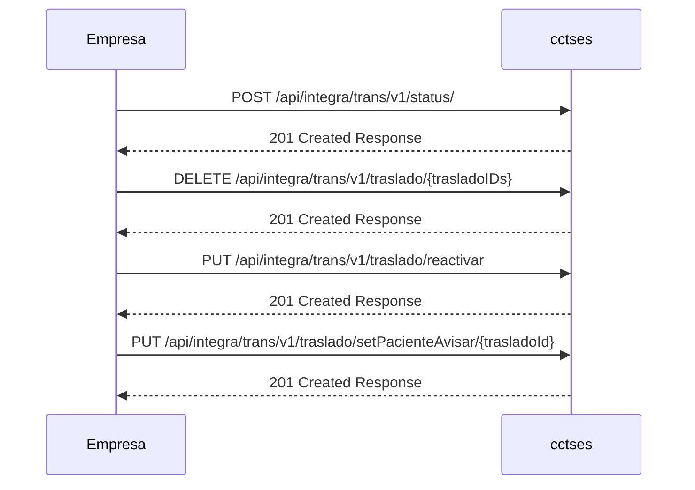

## **4.1 CircuitoA. Empresa ➡️ CCTSES**

Este servicio-web recibirá las peticiones enviadas desde la empresa concesionaria a CCTSES.

### 4.1.1 Información general de la API

- Nombre: API de Integración de Transporte
- Versión: 1.6
- Base URL: https://api.miempresa.com/v1




---

### 4.1.2 Operaciones REST

1) POST /api/integra/trans/v1/status/

| Campo | Detalle |
|:--|:--|
| Método | POST |
| Ruta | /api/integra/trans/v1/status/ |
| operationId | status |
| Resumen | Crea o actualiza una orden (evento de estado) |
| Descripción | Informa estados puntuales de recursos (vehículo, traslado, jornada) y posicionamiento GPS. Casos de uso: cambio de estado de traslado/vehículo, inicio/fin de jornada, modos especiales, información periódica, asignación/desasignación de traslado. |
| Body | application/json: StatusInfo |
| Campos | - StatusInfo.status: array de Status<br>- Campos de Status y sus referencias:<br>• idEstadoTraslado: código en [TB_TRASLADO_ESTADOS](CircuitoA-doc_funcional.md#entidad-tb_traslado_estados)<br>• idEstadoVehiculo: código en [TB_VEHICULO_ESTADOS](CircuitoA-doc_funcional.md#entidad-tb_vehiculo_estados)<br>• idMotivo: código del motivo del status en [TB_MOTIVO_ESTADOS](CircuitoA-doc_funcional.md#entidad-tb_motivo_estados)<br>• idActividadJornada: código en [TB_ACTIVIDAD_TIPOS](CircuitoA-doc_funcional.md#entidad-tb_actividad_tipos) |
| Respuestas | 201: Response<br>400: Response (validación)<br>500: Response (error interno) |

**Ejemplo de request**
```json
{
  "status": [
    {
      "idTrasladoCCTSES": "TR-1001",
      "idTrasladoExterno": "EXT-9A",
      "idVehiculo": "0001-JKL",
      "idUnidad": "U-12",
      "idEstadoTraslado": "E",
      "idEstadoVehiculo": "4",
      "fechaHora": "2025-02-12T20:26:28+02:00",
      "idMotivo": "2",
      "gps": {
        "longitud": "-0.376288",
        "latitud": "39.469907",
        "rumbo": 180,
        "velocidad": 42
      },
      "idActividadJornada": "1",
      "idJornada": "JRN-2025-001"
    }
  ]
}
```

**Ejemplo de respuesta (201)**
```json
{
  "resultado": {
    "estado": "AA",
    "codigo": "000",
    "descripcion": "OK"
  }
}
```

2) DELETE /api/integra/trans/v1/traslado/{trasladoIDs}

| Campo | Detalle |
|:--|:--|
| Método | DELETE |
| Ruta | /api/integra/trans/v1/traslado/{trasladoIDs} |
| operationId | traslado |
| Resumen | Anula uno o varios traslados |
| Descripción | Petición de anulación para una lista de traslados (IDs separados por coma). |
| Parámetros | path trasladoIDs (string, requerido): IDs separados por “,”<br>query fechaHora (date-time, requerido): fecha/hora de la solicitud<br>query idMotivo (string, requerido): motivo de anulación<br>query txMotivo (string, opcional): texto libre del motivo |
| Respuestas | 201: Response<br>400: Response<br>500: Response |
| Reglas/Observaciones | El motivo de anulación debe existir en [TB_ANULACION_MOTIVOS](CircuitoA-doc_funcional.md#entidad-tb_anulacion_motivos). El sistema rechazará códigos no registrados. |

**Ejemplo de llamada**
```text
DELETE /api/integra/trans/v1/traslado/TR-1001,TR-1002?fechaHora=2025-11-15T09:00:00Z&idMotivo=SP&txMotivo=Anula%20paciente
```

**Ejemplo de respuesta (201)**
```json
{
  "resultado": {
    "estado": "AA",
    "codigo": "000",
    "descripcion": "OK"
  }
}
```

3) PUT /api/integra/trans/v1/traslado/reactivar

| Campo | Detalle |
|:--|:--|
| Método | PUT |
| Ruta | /api/integra/trans/v1/traslado/reactivar |
| operationId | putTrasladoReactivacion |
| Resumen | Reactiva uno o varios traslados |
| Body | application/json: TrasladoReactivaDto |
| Campos | trasladoIDs (string, opcional, IDs separados por “,”)<br>fechaHora (date-time, requerido)<br>idMotivo (string, requerido)<br>txMotivo (string, opcional) |
| Respuestas | 201: Response<br>400: Response<br>500: Response |

**Ejemplo de request**
```json
{
  "trasladoIDs": "TR-1001,TR-1002",
  "fechaHora": "2025-11-15T10:15:00Z",
  "idMotivo": "REU",
  "txMotivo": "Reactivación por reubicación"
}
```

**Ejemplo de respuesta (201)**
```json
{
  "resultado": {
    "estado": "AA",
    "codigo": "000",
    "descripcion": "Reactivación aceptada"
  }
}
```

4) PUT /api/integra/trans/v1/traslado/setPacienteAvisar/{trasladoId}

| Campo | Detalle |
|:--|:--|
| Método | PUT |
| Ruta | /api/integra/trans/v1/traslado/setPacienteAvisar/{trasladoId} |
| operationId | putPacienteAvisar |
| Resumen | Establece el estado “paciente-avisar” en un traslado |
| Parámetros | path trasladoId (string, requerido)<br>query horaRecoger (date-time, requerido) |
| Respuestas | 201: Response<br>500: Response |

**Ejemplo de llamada**
```text
PUT /api/integra/trans/v1/traslado/setPacienteAvisar/TR-1001?horaRecoger=2025-11-15T07:30:00Z
```

**Ejemplo de respuesta (201)**
```json
{
  "resultado": {
    "estado": "AA",
    "codigo": "000",
    "descripcion": "OK"
  }
}
```

---

### 4.1.3 Modelos de datos (según OpenAPI)

- StatusInfo
  - status: array de Status

- Status
  - idTrasladoCCTSES (string, opcional)
  - idTrasladoExterno (string, opcional)
  - idVehiculo (string, requerido)
  - idUnidad (string, requerido)
  - idEstadoTraslado (string, opcional) → [TB_TRASLADO_ESTADOS](CircuitoA-doc_funcional.md#entidad-tb_traslado_estados)
  - idEstadoVehiculo (string, opcional) → [TB_VEHICULO_ESTADOS](CircuitoA-doc_funcional.md#entidad-tb_vehiculo_estados)
  - fechaHora (date-time, requerido)
  - idMotivo (string, opcional) → [TB_MOTIVO_ESTADOS](CircuitoA-doc_funcional.md#entidad-tb_motivo_estados)
  - gps (objeto Gps, opcional según caso de uso)
  - idActividadJornada (string, opcional) → [TB_ACTIVIDAD_TIPOS](CircuitoA-doc_funcional.md#entidad-tb_actividad_tipos)
  - idJornada (string, opcional)

- Gps
  - longitud (string), latitud (string), rumbo (number), velocidad (integer)

- TrasladoReactivaDto
  - trasladoIDs (string, opcional, IDs separados por “,”)
  - fechaHora (date-time, requerido)
  - idMotivo (string, requerido)
  - txMotivo (string, opcional)

- Response
  - resultado: Result

- Result
  - estado (string): AA=OK, AE=Error
  - codigo (string): 000=correcto
  - descripcion (string)

Notas de validación y negocio:
- Los códigos de referencia de tablas TB_ deben existir en sus correspondientes catálogos funcionales.
- Para anulaciones, los códigos deben pertenecer a TB_ANULACION_MOTIVOS. Para cambios de estado, los motivos seguirán TB_MOTIVO_ESTADOS y los estados, TB_TRASLADO_ESTADOS o TB_VEHICULO_ESTADOS.


