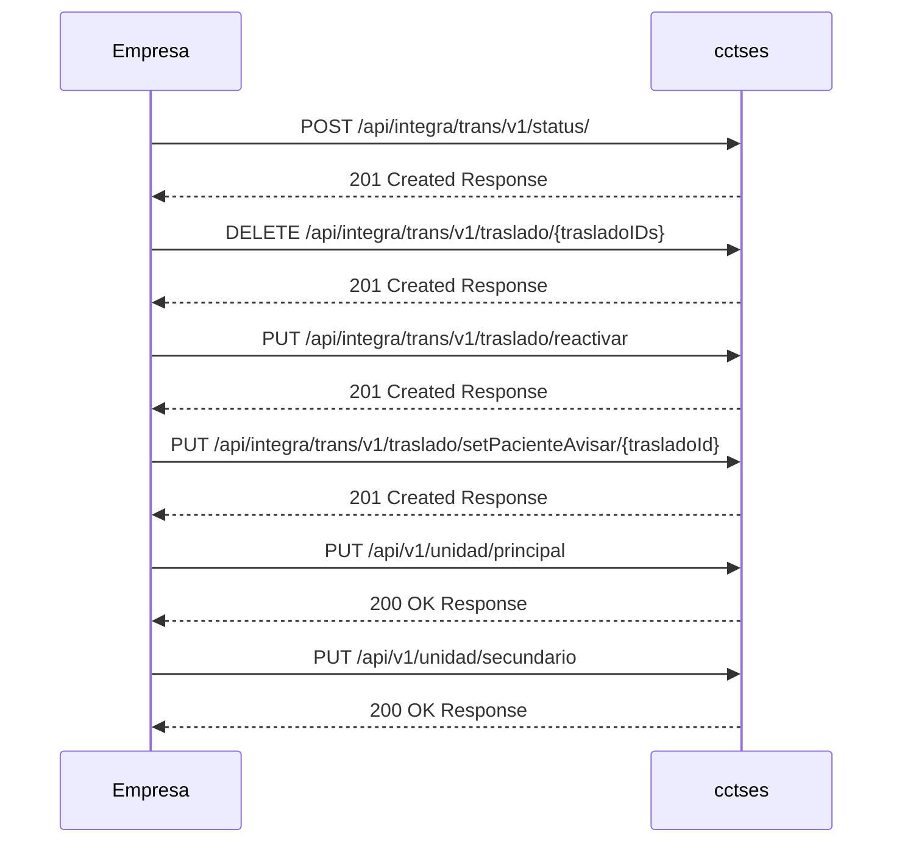

# **CircuitoA. Empresa ➡️ CCTSES**

## **Documentación técnica**

Este servicio-web recibirá las peticiones enviadas desde la empresa concesionaria a CCTSES.

### Información general de la API

- Nombre: API de Integración CCTSES. CircuitoA
- Versión: 1.6
- Base URL: https://{server}:{puerto}/api/integra/trans/v1




---

### Operaciones REST

1) **POST /api/integra/trans/v1/status/**

Alta de un nuevo status (cambio de estado)

| Propiedad | Descripción                                                                                                                                                                                                                                                                                                                                                                                          |
|:--|:-----------------------------------------------------------------------------------------------------------------------------------------------------------------------------------------------------------------------------------------------------------------------------------------------------------------------------------------------------------------------------------------------------|
| Método | POST                                                                                                                                                                                                                                                                                                                                                                                                 |
| Ruta | /api/integra/trans/v1/status/                                                                                                                                                                                                                                                                                                                                                                        |
| operationId | status                                                                                                                                                                                                                                                                                                                                                                                               |
| Resumen | Alta de un nuevo status (cambio de estado)                                                                                                                                                                                                                                                                                                                                                                             |
| Descripción | Informa estados puntuales de recursos (vehículo, traslado, jornada) y posicionamiento GPS.<br>Casos de uso:<br>- cambio de estado de traslado/vehículo,<br>- inicio/fin de jornada,<br> - modos especiales,<br>- información periódica,<br>- asignación/desasignación de traslado.<br><br>Todos estos casos quedan recogidos en [motivo_status](CircuitoA-doc_funcional.md#entidad-tb_motivo_status) |
| Body | application/json: StatusInfo                                                                                                                                                                                                                                                                                                                                                                         |
| Respuestas | 201: Response<br>400: Response (validación)<br>500: Response (error interno)                                                                                                                                                                                                                                                                                                                         |

??? info "Tipos de datos"

    StatusInfo

    | Propiedad | Tipo | Descripción |
    |:--|:--|:--|
    | status | array<Status> | Lista de elementos Status a reportar en la operación. |

    Status

    | Propiedad | Tipo | Descripción |
    |:--|:--|:--|
    | idTrasladoCCTSES | string | Id único del traslado en CCTSES (opcional). |
    | idTrasladoExterno | string | Id único del traslado en el sistema externo (opcional). |
    | idVehiculo | string | Matrícula del vehículo asociado al status (requerido). |
    | idUnidad | string | Id de la unidad administrativa asociada al status (requerido). |
    | idEstadoTraslado | string | Id del estado del traslado (opcional). Referencia: [TB_TRASLADO_ESTADOS](CircuitoA-doc_funcional.md#entidad-tb_traslado_estados). |
    | idEstadoVehiculo | string | Id del estado del vehículo (opcional). Referencia: [TB_VEHICULO_ESTADOS](CircuitoA-doc_funcional.md#entidad-tb_vehiculo_estados). |
    | fechaHora | date-time | Fecha y hora del estado en hora local (formato ISO 8601). Ejemplo: 2021-02-12T20:26:28+02:00 (requerido). |
    | idMotivo | string | Motivo/origen del status (opcional). Referencia: [TB_MOTIVO_ESTADOS](CircuitoA-doc_funcional.md#entidad-tb_motivo_estados). |
    | gps | Gps | Posición GPS donde se ha generado el status (opcional según caso de uso). |
    | idActividadJornada | string | Tipo de actividad de la jornada (opcional). Referencia: [TB_ACTIVIDAD_TIPOS](CircuitoA-doc_funcional.md#entidad-tb_actividad_tipos). |
    | idJornada | string | Id/código de la jornada en la que se ha generado este status (opcional). |
    | kms       | number | Kilómetros del vehículo en el momento de la operación (opcional). |


    Gps

    | Propiedad | Tipo | Descripción |
    |:--|:--|:--|
    | longitud | string | Longitud en grados decimales. |
    | latitud | string | Latitud en grados decimales. |
    | rumbo | number | Rumbo del vehículo (grados). |
    | velocidad | integer | Velocidad del vehículo. |

**Ejemplo de request**
```json
{
  "status": [
    {
      "idTrasladoCCTSES": "TR-1001",
      "idTrasladoExterno": "EXT-9A",
      "idVehiculo": "0001-JKL",
      "idUnidad": "U-12",
      "idEstadoTraslado": "E",
      "idEstadoVehiculo": "4",
      "fechaHora": "2025-02-12T20:26:28+02:00",
      "idMotivo": "2",
      "gps": {
        "longitud": "-0.376288",
        "latitud": "39.469907",
        "rumbo": 180,
        "velocidad": 42
      },
      "idActividadJornada": "1",
      "idJornada": "JRN-2025-001",
      "kms": 0
    }
  ]
}
```

**Ejemplo de respuesta (201)**
```json
{
  "resultado": {
    "estado": "AA",
    "codigo": "000",
    "descripcion": "OK"
  }
}
```

2) **DELETE /api/integra/trans/v1/traslado/{trasladoIDs}**

Anulación de un traslado. Previamente se debe haber realizado una solicitud de anulación.

| Propiedad | Descripción |
|:--|:--|
| Método | DELETE |
| Ruta | /api/integra/trans/v1/traslado/{trasladoIDs} |
| Resumen | Anula uno o varios traslados |
| Descripción | Petición de anulación para una lista de traslados (IDs separados por coma). |
| Respuestas | 201: Response<br>400: Response<br>500: Response |
| Reglas/Observaciones | El motivo de anulación debe existir en [TB_ANULACION_MOTIVOS](CircuitoA-doc_funcional.md#entidad-tb_anulacion_motivos). El sistema rechazará códigos no registrados. |

??? info "Parámetros"

    Path

    | Propiedad | Tipo | Descripción |
    |:--|:--|:--|
    | trasladoIDs | string | IDs separados por ",". Requerido. |

    Query

    | Propiedad | Tipo | Descripción |
    |:--|:--|:--|
    | fechaHora | date-time | Fecha y hora de la solicitud. Requerido. |
    | idMotivo | string | Motivo de la anulación. Requerido. Ver tabla: [TB_ANULACION_MOTIVOS](./CircuitoA-doc_funcional.md#tb_anulacion_motivos) |
    | txMotivo | string | Texto libre del motivo de la anulación. Opcional. |

**Ejemplo de llamada**
```text
DELETE /api/integra/trans/v1/traslado/TR-1001,TR-1002?fechaHora=2025-11-15T09:00:00Z&idMotivo=SP&txMotivo=Anula%20paciente
```

**Ejemplo de respuesta (201)**
```json
{
  "resultado": {
    "estado": "AA",
    "codigo": "000",
    "descripcion": "OK"
  }
}
```

3) **PUT /api/integra/trans/v1/traslado/reactivar**

Reactivación de un traslado anulado que había sido anulado previamente.

| Propiedad | Descripción |
|:--|:--|
| Método | PUT |
| Ruta | /api/integra/trans/v1/traslado/reactivar |
| Resumen | Reactiva uno o varios traslados |
| Body | application/json: TrasladoReactivaDto |
| Respuestas | 201: Response<br>400: Response<br>500: Response |

??? info "Tipos de datos"

    TrasladoReactivaDto

    | Propiedad | Tipo | Descripción |
    |:--|:--|:--|
    | trasladoIDs | string | ID o IDs de los traslados separados por coma (opcional). |
    | fechaHora | date-time | Fecha y hora de la solicitud de reactivación (requerido). |
    | idMotivo | string | Motivo de la reactivación (requerido). |
    | txMotivo | string | Texto libre del motivo de la reactivación (opcional). |

**Ejemplo de request**
```json
{
  "trasladoIDs": "TR-1001,TR-1002",
  "fechaHora": "2025-11-15T10:15:00Z",
  "idMotivo": "REU",
  "txMotivo": "Reactivación por reubicación"
}
```

**Ejemplo de respuesta (201)**
```json
{
  "resultado": {
    "estado": "AA",
    "codigo": "000",
    "descripcion": "Reactivación aceptada"
  }
}
```

---


<a id="op-put-api-v1-unidad-principal"></a>

4) **PUT /api/v1/unidad/principal**

Asigna un vehículo como Principal a la Unidad indicada.

Propiedad | Descripción
:--|:--
Método | PUT
Ruta | /api/v1/unidad/principal
Resumen | Asigna un vehículo como Principal a la Unidad indicada
Body | (sin cuerpo)
Respuestas | 201: Response<br>400: Response<br>500: Response

Parámetros

Query

Propiedad | Tipo | Requerido | Descripción
:--|:--|:--:|:--
idUnidad | string |  | Identificador de la unidad adscrita
idVehiculo | string |  | Identificador/matrícula del vehículo

#### **Ejemplo de llamada**

```text
PUT /api/v1/unidad/principal?idUnidad=UNI-01&idVehiculo=1234ABC
```

Tipos de datos: ver sección [Tipo de datos](#tipos-de-datos).

---

<a id="op-put-api-v1-unidad-secundario"></a>

5) **PUT /api/v1/unidad/secundario**

Asigna un vehículo como Secundario a la Unidad indicada.

Propiedad | Descripción
:--|:--
Método | PUT
Ruta | /api/v1/unidad/secundario
Resumen | Asigna un vehículo como Secundario a la Unidad indicada
Body | (sin cuerpo)
Respuestas | 201: Response<br>400: Response<br>500: Response

Parámetros

Query

Propiedad | Tipo | Requerido | Descripción
:--|:--|:--:|:--
idUnidad | string |  | Identificador de la unidad adscrita
idVehiculo | string |  | Identificador/matrícula del vehículo

#### **Ejemplo de llamada**

```text
PUT /api/v1/unidad/secundario?idUnidad=UNI-01&idVehiculo=5678DEF
```

Tipos de datos: ver sección [Tipo de datos](#tipos-de-datos).

---


